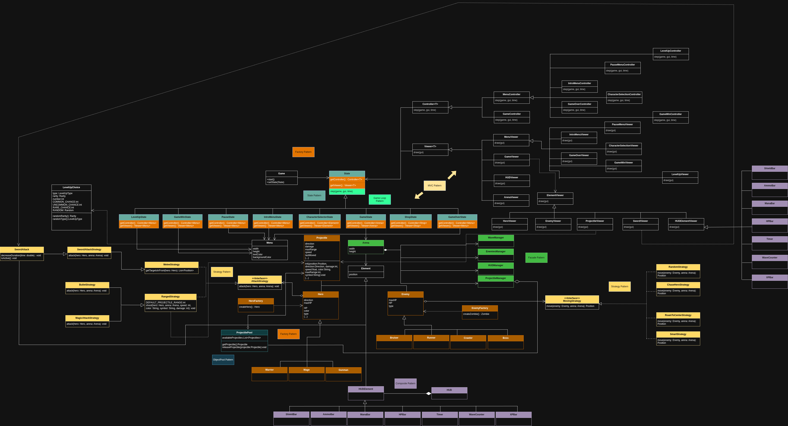
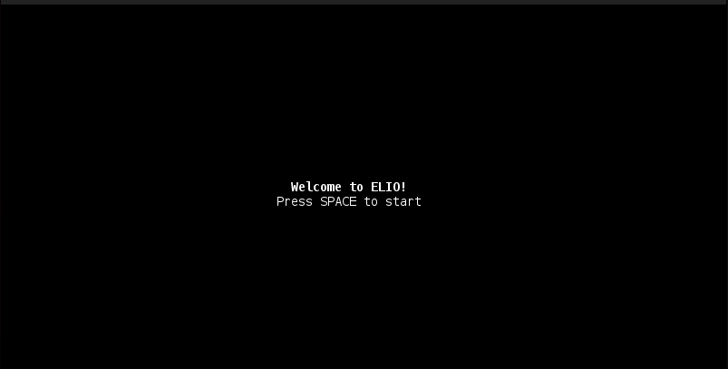
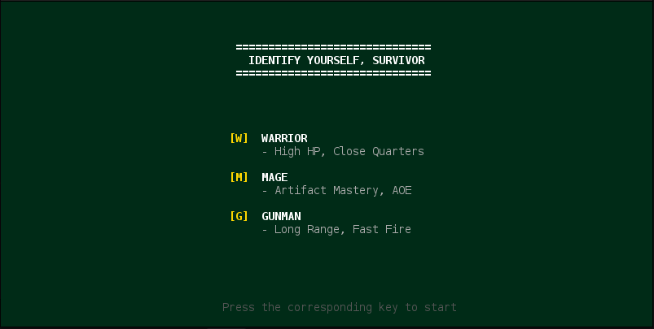
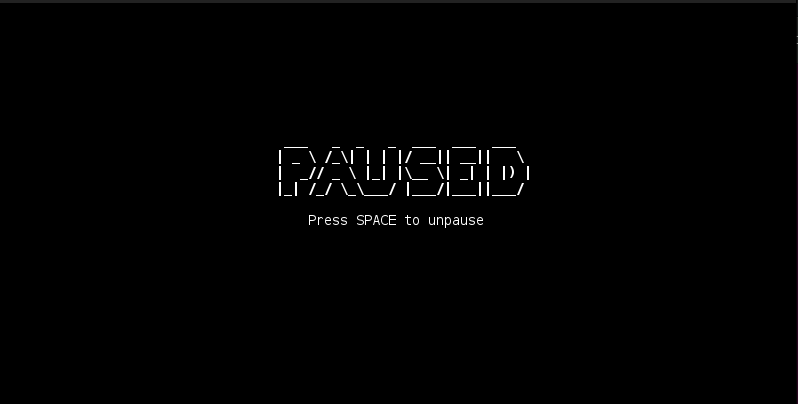
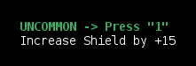
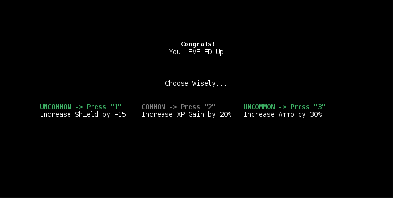
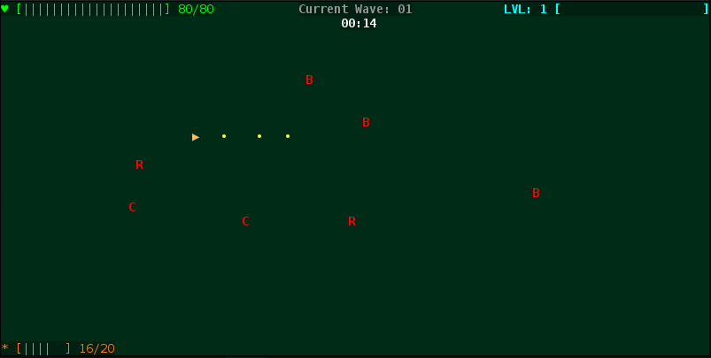
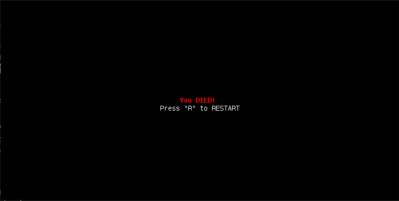
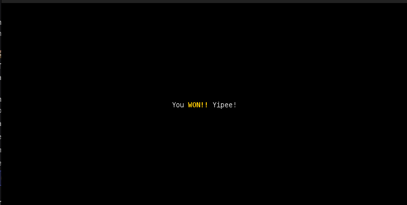
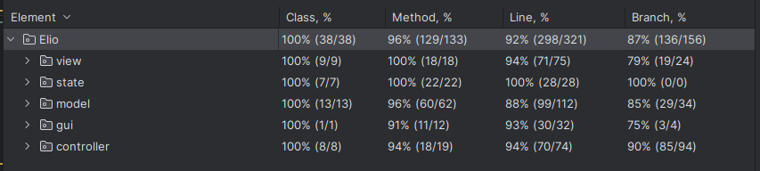

## LDTS_1308 - ELIO

In this thrilling RPG game you become Elio, the last survivor on Earth. You will have to face several waves of different types of zombies to recover a powerful artifact that will end the Zombie Apocalypse that took over your planet. Every ten rounds a boss appears. At the end of each round, unlock new enhancements to become more powerful.

This project was developed by *Rodrigo Teixeira* (*up202404802@fe.up.pt*), *Rui Gomes* (*up202404805@fe.up.pt*) and *João Fernandes* (*up202406511@fe.up.pt*).

### UML DIAGRAM

### IMPLEMENTED FEATURES

- **Menu Navigation** - User can navigate through the main menu, character selection menu and game screen using keyboard inputs.

Final Implementation of the Main Menu.

- **Hero Selection** - User can select between different hero characters, each with unique attributes and abilities.
Currently, we do not have the different game mechanics implemented (only the HP Bar), which differ from one character to another, but we plan to add them in the future.

Final Implementation of the Hero Selection Menu.

- **Pause Menu** - User can pause the game at any time, accessing the pause menu to resume or quit the game('ESC' key).

Final Implementation of the Pause Menu.

- **Hero Movement** - The hero can move around the game screen using keyboard inputs (WASD/Arrow Keys).

- **HUD** - The game screen displays a HUD (Heads-Up Display) that shows the hero's health bar, shield bar, current wave, elapsed time, and bullets (if that is the case).

- **Hero Types** - We have implemented three different hero types: Warrior, Gunman, and Mage.
Each hero type has unique attributes such as appearance (color), health points, attack power, and movement speed.

- **Health & Shield System** - The hero has a health system represented by a health bar displayed on the screen.
The health bar decreases when the hero takes damage from enemies. If the health bar reaches zero, the game ends.
Additionally, we have implemented a shield system that provides extra protection to the hero. 
The shield absorbs damage before it affects the health bar.
This shield can be obtained through upgrades and is permanent once selected.

Example of Shield Upgrade in the Level Up Screen.

- **Shield Regeneration** - The hero's shield regenerates over time when not taking damage.
If the hero takes damage, the shield regeneration is temporarily paused for a short duration.

- **Level Up System** - Each zombie type gives different XP rewards when defeated. When the hero accumulates enough XP, they level up.
Upon leveling up, the player is presented with a level-up screen where they can choose from a selection of three upgrades to enhance their hero's abilities.
Upgrades can include health, attack power, XP gain and special abilities depending on which hero the player chose.
    - **Upgrade Selection** - The player can select the upgrade options using keyboard inputs and select their desired upgrade.
    - **Special Upgrades** - Each hero has a unique special upgrade that enhances their abilities in a significant way.
      - **Warrior**: 
          - "Hardness" - The hero becomes more durable, reducing taken damage.
          - "Lifesteal" - A portion of the damage dealt to enemies is converted into health for the hero.
      
      - **Gunsman**:
        - "Reload Speed" - The hero's reload speed is increased, taking him less time to attack again.
        - "Increase Ammo" - The hero's ammo capacity is increased.

Final Implementation of the Level Up Screen.

- **Attack Mechanism** - The hero can attack enemies using different attacking patterns:
  - **Warrior**: Sword attack (Attacks enemies in adjacent tiles (depending on which direction the player is facing it attacks that tile and the two tiles next to it))
  - **Gunman**: Shooting attack (Ranged attack that hits the first enemy in a straight line in the direction the player is facing, similar to a machine gun)
  - **Mage**: Mana attack (Resembles a fireball that travels in a straight line until it hits an enemy, dealing damage upon impact)

- **Projectiles** - As mentioned before for the Gunman and Mage heroes, we have implemented projectile mechanics. These
are managed through a **ProjectileManager** class that handles their movement, collision detection with enemies, and damage application upon impact.
Furthermore, we used an object pooling technique to optimize performance by reusing projectile objects instead of creating and destroying them frequently, on which we will elaborate later on.

    Classes related to projectile management can be found in the following files:
    - [Projectile.java](./src/main/java/Elio/model/Projectile.java)
    - [ProjectileManager.java](./src/main/java/Elio/model/ProjectileManager.java)
  

- **Enemies** - We have implemented different enemy types all derived from zombies.
  - **Runner**: A fast-moving zombie with low health and low damage.
  - **Bruiser**: A standard zombie with moderate health and damage.
  - **Crawler**: A slow-moving zombie with high health and high damage.
  - **Boss**: A powerful zombie that appears every ten waves, with high health and damage.

- **Movement Patterns** - We successfully implemented different movement patterns for the enemies:
    - **Chasing**: If the enemies are within 10 tiles of the hero, they will chase the hero directly.
    - **Random Movement**: If the enemies find themselves within the center area of the screen (a 10x10 square in the middle of the screen), they will move randomly in any direction.
    This allows them not to get stuck in the center of the screen and instead wander around until they are out of the center area.
    - **Roam to Center**: Standard way of enemies' movement. They will move towards the center of the game screen unless they are within range to chase the hero or inside the central area.
    - **Smart Movement**: Handles the way the enemies move.
  
  These can be found inside the following package:
  - [MovementStrategies](./src/main/java/Elio/model/movementStrategies)

- **Time System** - The game operates on a real-time system where both the hero and enemies can move and attack in real-time.
This system is managed through a game loop that updates the game state at regular intervals, allowing for smooth and responsive gameplay.

- **Timer** - A timer is displayed on the game screen, showing the elapsed time since the start of the game.

- **Waves System** - A wave system was included where enemies spawn in waves. Increasing the difficulty with each wave, with
more enemies and stronger enemies appearing as the waves progress.
Each wave the hero also recovers a portion of their health. 

- **Barriers** - The game screen contains barriers that the hero cannot pass through.
We implemented collision detection to prevent the hero from moving through these barriers. Unfortunately, we only managed to implement it for the barriers that impede the hero's movement inside the stats bars.

Final Implementation of the In-Game Screen, showcasing the Hero, Barriers, and Stats Bars.

- **Game Over Screen** - When the hero's health reaches zero, the game transitions to a game over screen.

Final Implementation of the Game Over Screen.

- **Win Screen** - If the player manages to survive all the waves (currently set to 30 waves), they are presented with a win screen.

Final Implementation of the Win Screen.

### PLANNED FEATURES

Unfortunately there were several features we planned to implement but couldn't. Here are some of them:
- **Boss Mechanics** - Each boss would have unique mechanics and attack patterns that the player must learn to overcome.

- **Sound Effects and Music** - Adding sound effects for actions like attacking, taking damage, and background music to enhance the gaming experience.

- **Endless Mode** - After completing the main waves, an endless mode where players can continue to fight increasingly difficult waves of enemies.

****

### DESIGN

### GAME STATES - STATE PATTERN

##### Problem in Context

Handling the different states of the game (Main Menu, In Game, Pause Menu, Game Over, etc.) can be tricky.
Instead of using a series of conditional statements scattered throughout the codebase, which would make it difficult to
manage and extend the game's functionality (and violate the **Single Responsibility Principle**), such as adding new states or modifying existing ones required changes in
multiple places, we looked for a more structured approach.

##### The Pattern

To address this issue, we applied the State Pattern. This design pattern is well-suited for scenarios where an object can be in multiple states, each with its own behavior. By encapsulating the behavior associated with each state into separate classes, we can simplify the management of state transitions and behaviors.

##### Implementation

We created an abstract `State` class that defines the common interface for all game states.

Each specific state extends this abstract class and implements its own behavior for handling user input and game events. The main game class maintains a reference to the current state and delegates state-specific behavior to the current state object.

The relevant classes can be found in the following files:

- [State.java](../src/main/java/Elio/state/State.java)
- [MenuState.java](../src/main/java/Elio/state/MenuState.java)
- [GameState.java](../src/main/java/Elio/state/GameState.java)
- [IntroMenuState.java](../src/main/java/Elio/state/IntroMenuState.java)
- [CharacterSelectionState.java](../src/main/java/Elio/state/CharacterSelectionState.java)
- [PauseState.java](../src/main/java/Elio/state/PauseState.java)
- [GameOverState.java](../src/main/java/Elio/state/GameOverState.java)
- [GameWinState.java](../src/main/java/Elio/state/GameWinState.java)
- [LevelUpState.java](../src/main/java/Elio/state/LevelUpState.java)

##### Consequences

The application of the State Pattern has led to several benefits in our game's design:
The game is based off different states that the player can be in, such as Main Menu, In Game, Pause Menu, Game Over, etc. Each state has its own behavior and transitions to other states based on user input or game events.

The State Pattern allows us to encapsulate the behavior associated with each state into separate classes, making it easier to manage and extend the game's functionality.
The use of the State Pattern in the current design allows the following benefits:

- The several states that represent the character’s hability to jump become explicit in the code, instead of relying on a series of flags.

- We don’t need to have a long set of conditional if or switch statements associated with the various states; instead, polimorphism is used to activate the right behavior.

- There are now more classes and instances to manage, but still in a reasonable number.

### CHARACTER CREATION - FACTORY METHOD PATTERN (ZOMBIES AND HERO)

##### Problem in Context
Creating different types of heroes/monsters with varying attributes and abilities can lead to complex
and tightly coupled code if not managed properly. Directly instantiating hero objects makes it difficult
to maintain and extend the game's functionality, especially if we mean to add new hero/zombie types or modify existing ones.

##### The Pattern

To address this issue, we applied the Factory Method Pattern. This design pattern provides an interface for
creating objects in a superclass, but allows subclasses to alter the type of objects that will be created.

##### Implementation

We created an abstract `HeroFactory` class that defines the method for creating character objects as well as an
`Enemy Factory` class that acts the same but for monsters.

Each specific hero/zombie type (e.g., Warrior, Gunman, Mage for heroes and Runner, Bruiser, Crawler for zombies) has its own factory subclass that implements the creation method to instantiate the appropriate hero/zombie object.
The relevant classes can be found in the following files:
- Heroes:
  - [HeroFactory.java](../src/main/java/Elio/model/hero/HeroFactory.java)
  - [Gunman.java](../src/main/java/Elio/model/hero/Gunman.java)
  - [Warrior.java](../src/main/java/Elio/model/hero/Warrior.java)
  - [Mage.java](../src/main/java/Elio/model/hero/Mage.java)
  

- Zombies:
  - [EnemyFactory.java](../src/main/java/Elio/model/enemy/EnemyFactory.java)
  - [Runner.java](../src/main/java/Elio/model/enemy/Runner.java)
  - [Bruiser.java](../src/main/java/Elio/model/enemy/Bruiser.java)
  - [Crawler.java](../src/main/java/Elio/model/enemy/Crawler.java)
  - [Boss.java](../src/main/java/Elio/model/enemy/Boss.java)

##### Consequences
The application of the Factory Method Pattern has led to several benefits in our game's design:
- The character creation logic is all in the same Factory Class, making it easier to manage and extend.
- New character types can be added by simply creating new factory subclasses without modifying existing code.
- The code verifies the Open/Closed Principle, as it is open for extension but closed for modification.

### ATTACK STRATEGY - STRATEGY PATTERN

##### Problem in Context
Implementing different attack strategies for heroes can lead to complex and confuse code. Directly coding the attack logic
within the character classes makes it difficult to maintain and add new attack types.

##### The Pattern
To address this issue, we plan to apply the Strategy Pattern. This design pattern defines an interface for a group of algorithms,
encapsulates each one, and makes them all available at the same time. This allows the algorithm to vary independently of
the clients that use it. 

##### Implementation
We will create an `AttackStrategy` interface that defines the method for executing an attack.
Each specific attack type (e.g., MeleeAttack, RangedAttack) will implement this interface.

The relevant classes will be found in the following files:
(ADD FILES HERE)

##### Consequences
The application of the Strategy Pattern will lead to several benefits in our game's design:
- The attack logic is separated from the character classes, making it easier to manage and extend.
- New attack types can be added by simply creating new strategy classes without modifying existing code.
- The code will verify the Open/Closed Principle.

### MOVEMENT STRATEGY - STRATEGY PATTERN

##### Problem in Context
Implementing different movement strategies for enemies can lead to complex and confuse code. Directly coding the movement logic
within the enemy classes makes it difficult to maintain and add new movement types.

##### The Pattern
To address this issue, we applied the Strategy Pattern. This design pattern defines an interface for a group of algorithms,
encapsulates each one, and makes them all available at the same time. This allows the algorithm to vary, independently of
the clients that use it.

##### Implementation
We created a `MovementStrategy` interface that defines the method for executing movement.
Each specific movement type (e.g., Chasing, RandomMovement, RoamToCenter) implements this interface.
The `SmartMovement` class is responsible for determining which movement strategy to use based on the enemy's position relative to the hero and the center of the screen.

The relevant classes can be found in the following files:
- [MovingStrategy.java](/home/teixeiraa05/Elio/src/main/java/Elio/model/movingStrategies/ChaseHeroStrategy.java)
- [ChaseHeroStrategy.java](/home/teixeiraa05/Elio/src/main/java/Elio/model/movingStrategies/ChaseHeroStrategy.java)
- [RandomStrategy.java](/home/teixeiraa05/Elio/src/main/java/Elio/model/movingStrategies/RandomStrategy.java)
- [RoamToCenterStrategy.java](/home/teixeiraa05/Elio/src/main/java/Elio/model/movingStrategies/RoamToCenterStrategy.java)
- [SmartStrategy.java](/home/teixeiraa05/Elio/src/main/java/Elio/model/movingStrategies/SmartStrategy.java)

##### Consequences
The application of the Strategy Pattern has led to several benefits in our game's design:
- The movement logic is separated from the enemy classes, making it easier to manage and extend.
- New movement types can be added by simply creating new strategy classes without modifying existing code.
- The code verifies the Open/Closed Principle.

### FACADE PATTERN - ARENA CLASS

##### Problem in Context
The `Arena` class serves as the central hub for managing various game components, including the hero, enemies, projectiles and HUD.
Directly interacting with these components can lead to complex code, making arena behave like a "God Object" that knows too much about the system and has too many responsibilities.

##### The Pattern
To address this issue, we applied the Facade Pattern. This design pattern uses the Arena class as a central point 
to the complex subsystem of game components. The Game State then only needs to interact with the Arena class, by calling 
arena.update().

##### Implementation
The `Arena` class encapsulates the interactions between the hero, enemies, and projectiles, 
providing methods for updating the game state, handling collisions, and managing game logic.

The relevant class can be found in the following file:
- [Arena.java](/home/teixeiraa05/Elio/src/main/java/Elio/model/Arena.java)
- [GameState.java](/home/teixeiraa05/Elio/src/main/java/Elio/state/GameState.java)
- [ProjectileManager.java](/home/teixeiraa05/Elio/src/main/java/Elio/model/arena/ProjectileManager.java)
- [EnemyManager.java](/home/teixeiraa05/Elio/src/main/java/Elio/model/arena/EnemyManager.java)
- [HUDManager.java](/home/teixeiraa05/Elio/src/main/java/Elio/model/HUD/HUDManager.java)
- [WaveManager.java](/home/teixeiraa05/Elio/src/main/java/Elio/model/waves/WaveManager.java)

##### Consequences
The application of the Facade Pattern has led to several benefits in our game's design:
- The `Arena` class provides a simplified interface for interacting with more complex classes of game components
- The `GameState` class is less coupled to the specific implementations of game components and only interacts with the `Arena` class.
- The `Arena` class has better organization and provides readable code.

### COMPOSITION PATTERN - HEADS-UP DISPLAY (HUD)

##### Problem in Context
The Heads-Up Display (HUD) in the game is responsible for displaying various game statistics, such as the hero's health, shield, current wave, elapsed time, and ammunition.
Were we to implement each of these components directly within the HUD class, it would lead to complex and unsustainable code.

##### The Pattern
To address this issue, we applied the Composition Pattern. 
This design pattern allows us to build complex objects (HUD) by combining simpler, reusable components (HUDElements).

##### Implementation
The `HUD` class contains multiple `HUDElement` objects, each responsible for rendering a specific part of the HUD.
Each `HUDElement` class implements a common interface, allowing the `HUD` class to manage and render them uniformly.
The relevant classes can be found in the following files:
- [HUD.java](/home/teixeiraa05/Elio/src/main/java/Elio/model/HUD/HUD.java)
- [HUDElement.java](/home/teixeiraa05/Elio/src/main/java/Elio/model/HUD/HUDElement.java)
- [XPBar.java](/home/teixeiraa05/Elio/src/main/java/Elio/model/HUD/XPBar.java)
- [HPBar.java](/home/teixeiraa05/Elio/src/main/java/Elio/model/HUD/HPBar.java)
- [ShieldBar.java](/home/teixeiraa05/Elio/src/main/java/Elio/model/HUD/ShieldBar.java)
- [WaveCounter.java](/home/teixeiraa05/Elio/src/main/java/Elio/model/HUD/WaveCounter.java)
- [Timer.java](/home/teixeiraa05/Elio/src/main/java/Elio/model/HUD/Timer.java)
- [AmmoBar.java](/home/teixeiraa05/Elio/src/main/java/Elio/model/HUD/AmmoBar.java)
- [ManaBar.java](/home/teixeiraa05/Elio/src/main/java/Elio/model/HUD/ManaBar.java)

##### Consequences

The application of the Composition Pattern has led to several benefits in our game's design:
- The `HUD` class is composed of smaller, manageable components, therefore easier to extend (if we want to add new elements to the HUD, we can simply create a new class and add it to the `HUD` class).
- Each `HUDElement` class has a single responsibility.

### OBJECT POOLING - PROJECTILES

##### Problem in Context
In our game, the Gunman and Mage heroes can shoot projectiles (bullets and fireballs, respectively). 
Creating and destroying projectile objects frequently can lead to performance issues, specially considering that the 
Gunman can shoot multiple bullets in a short span of time.

##### The Pattern
To address this issue, we applied the Object Pooling Pattern. 
For this we created a pool of reusable projectile objects that can be activated and deactivated as needed,
instead of creating and destroying them whenever we shot a projectile.

##### Implementation
We created a `ProjectilePool` class that manages a collection of projectile objects.
When a projectile is needed, the pool provides an inactive projectile from the pool, activates it, and returns it to the requester.
When a projectile is no longer needed (e.g., it goes out-of-range or hits an enemy), it is deactivated and returned to the pool for future use.
The relevant classes can be found in the following files:
- [ProjectilePool.java](/home/teixeiraa05/Elio/src/main/java/Elio/model/attackStrategies/ProjectilePool.java)
- [Projectile.java](/home/teixeiraa05/Elio/src/main/java/Elio/model/attackStrategies/Projectile.java)
- [ProjectileManager.java](/home/teixeiraa05/Elio/src/main/java/Elio/model/arena/ProjectileManager.java)

##### Consequences
The application of the Object Pooling Pattern has led to several benefits in our game's design:
- Improved performance by reducing the amount of object creation.
- Reduced memory usage by reusing existing objects.
- Simplified management of projectile objects.

#### KNOWN CODE SMELLS
  - **Numbers in the Code**: We have some instances of hardcoded numbers in the code, which can make it difficult to understand the meaning of these values.

  - **Long Methods**: Some methods in the code are quite long and could be broken down into smaller, more manageable methods to improve readability
    (such as the LevelUpViewer class).

  - **Long Parameter Lists**: Some methods have long parameter lists, which can make it difficult to understand the purpose of each parameter.

### TESTING

Coverage Report

### SELF-EVALUATION

- Rodrigo Teixeira: 42.5%

- Rui Gomes: 42.5%

- João Fernandes: 15%